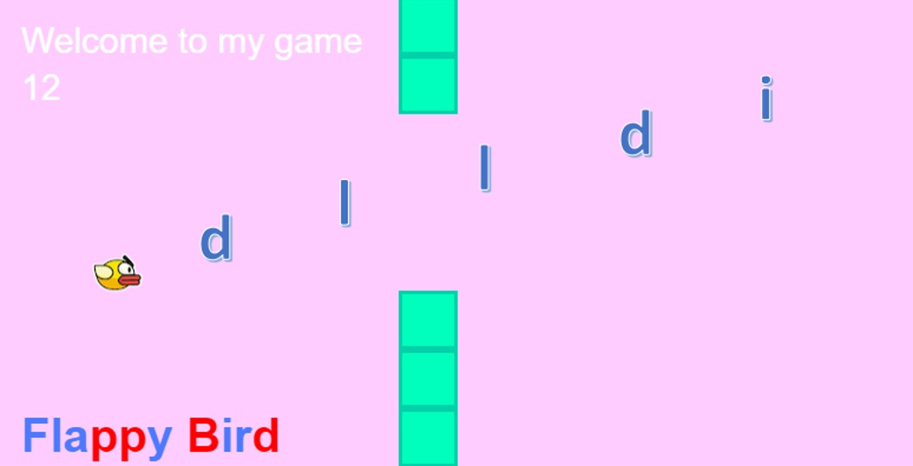
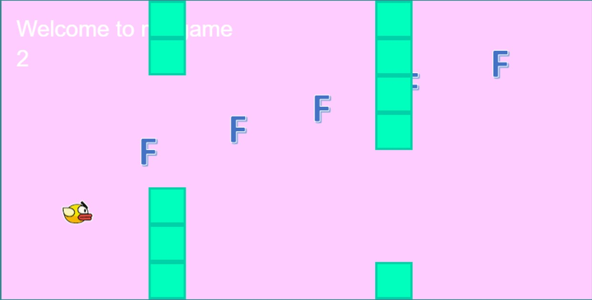
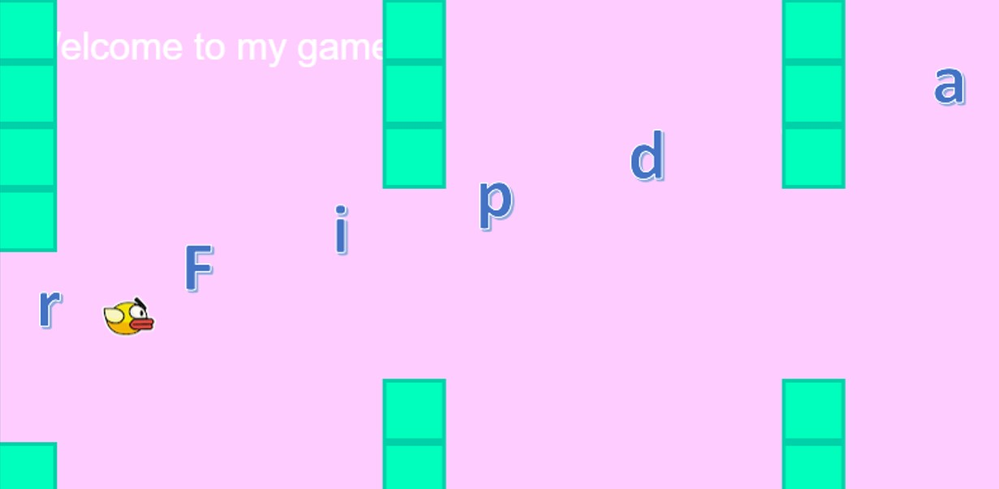
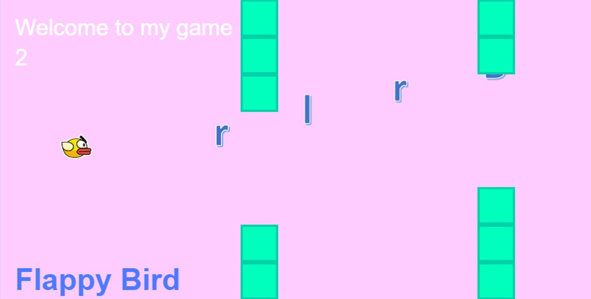
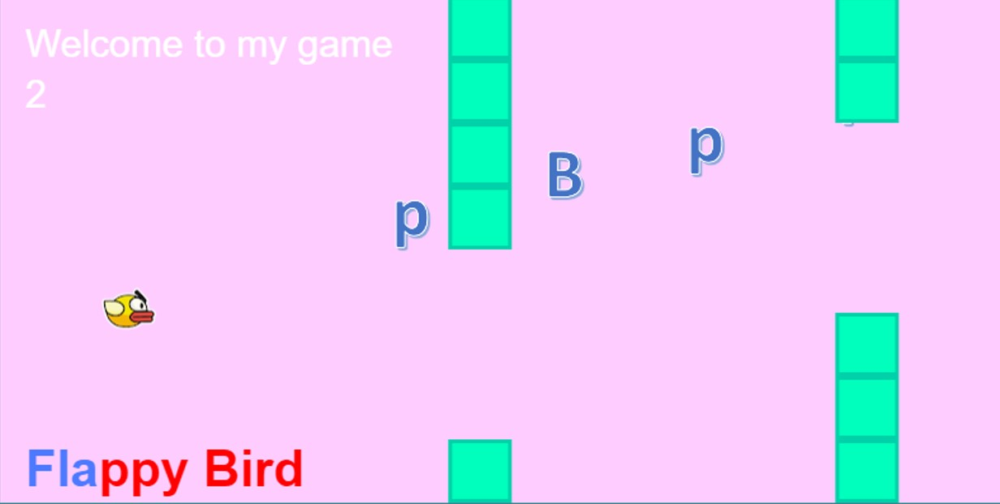

Increase your Flappy Bird score with "Floating Letters"
============

This tutorial presents a new version of Flappy Bird with  floating letters on the game canvas. The letters are from the words "Flappy" and "Bird". Every time the player (sprite) collects one of the letters, the score will increase. On the bottom-left corner of the game canvas, the word "Flappy Bird" is displayed to keep track of which letters have been already collected.


*Screenshot of the final game*

Before starting, let's think about the different steps to obtain the final game:

1. The first step will be adding floating letters into the game canvas;
2. The second step will be increasing the score every time the sprite overlaps with a letter;
3. The last step will be changing the colour of the collected letters in order to keep track of which letters have been already collected.

Step 1. Adding floating letters to the game canvas
------------
The letters you will use in this tutorial are images already in the `assets/letters` folder. You can change those later by creating your own personalised letters.
As you already know, every time you want to add a new image to your game canvas, you need to include it in the `preload` function as follows:

```javascript
function preload(){
 ...
 game.load.image("letterF","../assets/letters/F.png");
 game.load.image("letterL","../assets/letters/L.png");
 game.load.image("letterA","../assets/letters/A.png");
 game.load.image("letterP","../assets/letters/P.png");
 game.load.image("letterY","../assets/letters/Y.png");
 game.load.image("letterB","../assets/letters/B.png");
 game.load.image("letterI","../assets/letters/I.png");
 game.load.image("letterR","../assets/letters/R.png");
 game.load.image("letterD","../assets/letters/D.png");
 }
```

Now, let's define a global array (out of any functions) to store the information about the letters generated and displayed on the game canvas (just like you did for the pipes):
```javascript
var letters = [];
```

We are ready to generate the first letter "F". Try to look at the function `generatePipes` and modify that accordingly. You can find the solution below:

```javascript
// Generate floating letters
function generateLetters(){
    //display on the canvas one of the letters
    // for now let's display the first one
    var letter = game.add.sprite(750,20,"letterF");
    //we need to scale it to the right size
    letter.scale.y = 0.5;
    letter.scale.x = 0.5;
    // insert it in the array letters
    letters.push(letter);
    // enable physics engine for the letter
    game.physics.arcade.enable(letter);
    // set the letters's velocity
    // (negative x value for velocity means movement will be towards left)
    letter.body.velocity.x = -80;
    letter.body.velocity.y = 20;
}
```

In order to use this function, we need to call it within the `create` function. We want to display a new letter every 3.5 second. Hence, exactly as you did for the pipes, type the following code in the `create` function.

```javascript
 var lettersInterval = 3.5;
    game.time.events
    .loop(lettersInterval * Phaser.Timer.SECOND,
    generateLetters);
```

Refresh now your game, you should see something like this:


*Floating "F"s are coming into the game canvas from the top-right corner.*

Cool! You added your first letters to the game canvas! Now, let's add all the other letters.
It would be nice adding some randomness in the order in which the letters come into the canvas so that completing the whole "Flappy Bird" word will be more challenging. You already used a random function to generate the gaps in the pipe-block, you can use the same instruction to define a new `pickLetter` function that randomly picks one of the "Flappy Bird" letters and adds it on the game canvas. You also need to store the position of the picked letter in the `letterPosition` array. You will understand why in a second.
So, define `var letterPosition = [];` and `var newLetter` as global variables (out of any functions) and add the following function for selecting a random letter.

```javascript
var lettersPosition = [];
var newLetter;

 function pickLetter() {
    // generate random numbers corresponding to the position of letters in the
    // "Flappy Bird" array containing 10 letters - from 0 to 9 excluding the space
	var diceRoll = game.rnd.integerInRange(0, 9);
	switch (diceRoll) {
	case 0:
    	newLetter = "letterF";
		lettersPosition.push(0);
    	break;
	case 1:
		newLetter = "letterL"
		lettersPosition.push(1);
        break;
    case 2:
		newLetter = "letterA"
		lettersPosition.push(2);
    	break;
    case 3:
		newLetter = "letterP"
		lettersPosition.push(3);
    	break;
    case 4:
		newLetter = "letterP"
		lettersPosition.push(4);
    	break;
    case 5:
		newLetter = "letterY"
		lettersPosition.push(5);
    	break;
    case 6:
		newLetter = "letterB"
        // the position of letter B is 7 because of the space
        //between the word "Flappy" and "Bird"
		lettersPosition.push(7);
    	break;
    case 7:
		newLetter = "letterI"
		lettersPosition.push(8);
    	break;
    case 8:
		newLetter = "letterR"
		lettersPosition.push(9);
    	break;
    case 9:
 		newLetter = "letterD"
		 lettersPosition.push(10);
 		break
	}
}
```

Now, modify the `generateLetters` function to pick a random letter.

```javascript

// Generate floating letters
function generateLetters(){
    // pick a new random letter
    pickLetter();
    //display on the canvas the newLetter sprite
    var letter = game.add.sprite(750,20,newLetter);
    //we need to scale it to the right size
    letter.scale.y = 0.5;
    letter.scale.x = 0.5;
    // insert it in the array letters
    letters.push(letter);
    // enable physics engine for the letter
    game.physics.arcade.enable(letter);
    // set the letters's velocity
    // (negative x value for velocity means movement will be towards left)
    letter.body.velocity.x = -80;
    letter.body.velocity.y = 20;
}
```

Refresh your game and look at the random letters coming into your game canvas!


*Floating random letters are coming into the game canvas from the top right corner.*


Step 2. Increasing the score every time the sprite overlaps a letter
------------
So far every time your sprite passes over one letter nothing special happens. How can you increase the score every time the sprite collects a letter? In order to do that, you can reuse part of the code you already wrote for the pipes in the `update` function. In that part of code, every time the sprite overlaps a pipe the game stops. Here, you need to use the same approach but every time the sprite overlaps a letter the score will increase.

For each letter in the `letters` array, you need to check if there is any overlapping with the sprite. Add the following code to the `update` function.

```javascript
// for each letter in the game canvas
for(var i=0; i< letters.length; i++){
	// check if there is any overlaps
	if(game.physics.arcade.overlap(player,letters[i])){
    // if there is an overlap, update the score
    updateScore();
	}
}
```

Every time there is an overlap, you are calling the function `updateScore()`. So let's now define the `updateScore()` function:

```javascript
function updateScore(){
changeScore();
changeScore();
}
```

This easy function is simply calling twice the `changeScore()` function so that two extra points will be added to your score. Refresh you game and look at the result.
As you may notice, there are some problems with the score. It keeps increasing for the whole time of the overlapping which is quite annoying. Moreover, it would be nice if each collected letter would disappear right after the overlapping. You can obtain a nice result by adding few more lines within the for loop in the `update` function and defining the `collectedLetters` array as global variable. Such array is used to store information about the collected letters (i.e. if the letter at position i has been collected, then `collectedLetters[i]` is equal to 1, otherwise `collectedLetters[i]` is equal to 0 ).

```javascript
// Global collectedLetters variable initialised to a zero-array as long as the
// "Flappy Bird" string (11 including the space).
var collectedLetters = new Array(11).fill(0);
```
Modify the for loop in the `update` function as follows:
```javascript
//for each letter in the game canvas
for(var i=0; i< letters.length; i++){
   // if there is any overlaps
   if (game.physics.arcade.overlap(player,letters[i])){
    // increase your score
	updateScore();
    //add the position of the new collected letter in the collectedLetters array
    collectedLetters[lettersPosition[i]] = 1;
    // remove the letter i from the game canvas
    letters[i].destroy();
    // remove the letter i from the array letters
    letters.splice(i,1);
    // remove the position of letter i from the lettersPosition array
    lettersPosition.splice(i,1);
    }
}
```

Now, refresh your game and start collecting as many letters as you can! You should also be able to see that the score increases by two every time the sprite collects a new letter.


Step 3. Changing the colour of the collected letters
------------
Now that you know how to increase the score every time the sprite and a letter overlap each other, let's write the code to change the colour of the corresponding letter in the "Flappy Bird" array. First, we want to add the word "Flappy Bird" at the bottom-left corner of the game canvas. So, you can define as external variable the `FBtext`

```javascript
var FBtext;
```
and display the text on the game canvas by adding in the `create` function:

```javascript
FBtext = game.add.text(20, 350, "Flappy Bird",
        {font: "40px Arial", fill: "#4d79ff",fontWeight: "bold"});
```

If you refresh your game you should see something like this:

*The string "Flappy Bird" is displayed at the bottom-left corner of the game canvas.*


In order to change the colour of the letters, we will use a predefined function already available in Phaser which is the `.addColor(color, position)` function. This function takes two arguments: the color we want to use and the position from which we want to color the letters. Type the following code at the end of your `create` function and look at the result.

```javascript
FBtext.addColor('#ff0000', 3);
```

You should see something like this:


*Result of FBtext.addColor('#ff0000', 3);*

As you can see, the function `FBtext.addColor` has changed into red all the letters from position 3 onwards (remember that the "F" is at position 0, "L" is at position 1 and so on). Hence, if we want to change the colour of only one letter in the array, we need to restore the original colour of the other letters on the right hand side. For this purpose, we will use the `collectedLetters` array that you have previously used in your `update` function. `collectedLetters` is an array which has 1 if a letter has been collected, zero otherwise. We can use this array in order to detect which letters need to be colored as red and which ones need to remain blue. Let's start by defining the `updateColour` function as follows:

```javascript
function updateColour(){
  // for each letter in the array of the collected letters
  for(i=0; i < collectedLetters.length; i++){
        // if the letter i has been collected, turn it into red
        if(collectedLetters[i] == 1){
            FBtext.addColor('#ff0000', i); //#ff0000 is red
        }
        // if the letter i has not been collected turn it into white
        if(collectedLetters[i] == 0){
           FBtext.addColor('#4d79ff', i); //#4d79ff is blue
        }
    }
}
```

If you type now `updateColour();` at the end of the for loop in the `update` function right after `lettersPosition.splice(i,1);`, you will see that every time a new letter is collected, its color changes! Remember to remove or comment the line `FBtext.addColor('#ff0000', 3);` you previously added and enjoy your new game!


**Possible Improvements:**

- The letters are not really "floating" but they are simply coming down from the top right corner. How would you add more randomness to their movements?
- The score increases every time the player collects a new letter, even though it has already been collected and turned into red. How would you control the score so that it will increase only the first time the player collects a given letter?
- It would be nice receiving few extra points when the player collects all the "Flappy Bird" letters. How would you do that?


